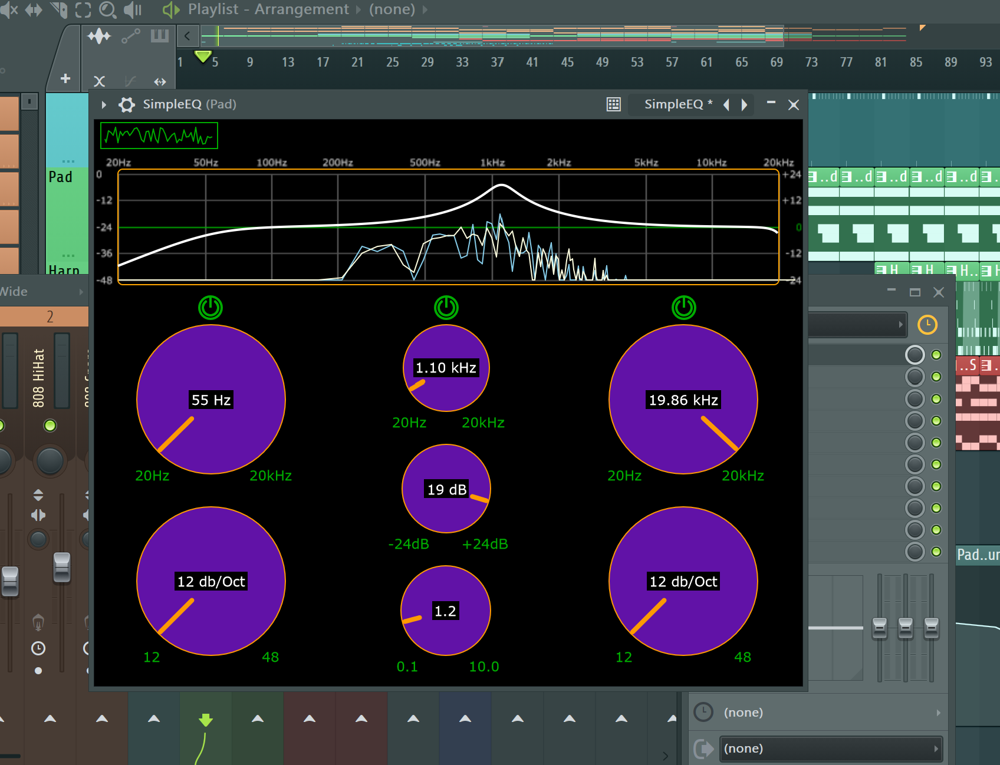
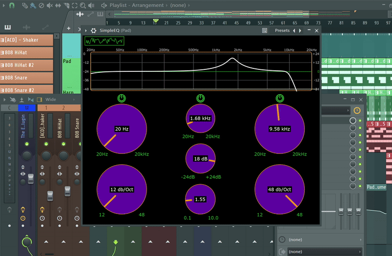

# SimpleEQ

**A 3-band equalizer VST/AU audio plugin built with JUCE, featuring customizable filters and real-time FFT-based frequency visualization.**





## Overview

SimpleEQ is a cross-platform audio plugin for digital audio workstations (DAWs), developed using C++ and the JUCE framework. It offers a 3-band equalizer with low-cut, peak, and high-cut filters, adjustable slopes (12–48 dB/octave), and a real-time frequency response curve powered by FFT analysis. The plugin features a custom-designed GUI with intuitive rotary sliders and bypass controls, showcasing skills in digital signal processing (DSP), GUI development, and modern C++ programming.

## Features

- **3-Band Equalization**:
  - Low-cut and high-cut filters: 20 Hz–20 kHz, 12–48 dB/octave slopes.
  - Peak filter: 20 Hz–20 kHz, ±24 dB gain, 0.1–10 Q.
- **Real-Time FFT Analysis**:
  - 2048-sample FFT with Blackman-Harris window for accurate frequency visualization.
  - Displays left (skyblue) and right (lightyellow) channel responses.
- **Custom GUI**:
  - Rotary sliders with dynamic labels (Hz, dB, dB/Oct) and custom styling.
  - Bypass buttons for each filter, disabling associated sliders when active.
- **Robust DSP**:
  - Butterworth filters for smooth frequency response.
  - Thread-safe parameter handling via `AudioProcessorValueTreeState`.
- **Compatibility**:
  - VST/AU formats, tested in FL Studio 21+, Ableton Live, etc.

## Technical Details

- **Language**: C++17
- **Framework**: JUCE 7.0+
- **Key Components**:
  - `PluginProcessor`: Manages audio processing and FIFO-based FFT data transfer.
  - `PluginEditor`: Implements custom sliders, buttons, and response curve visualization.
  - `FFTDataGenerator`: Processes audio for FFT analysis.
  - `LookAndFeel`: Customizes GUI aesthetics.
- **Dependencies**: JUCE (included via Projucer)
- **License**: GNU GPL v3.0

## Installation

**Clone Repository**:

```bash
git clone https://github.com/joshualopez7776/SimpleEQ.git
cd SimpleEQ
```
